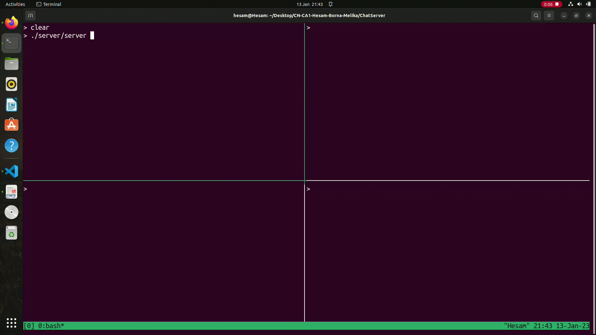

# Chat Server

## To Run:
Simply use make to make both server and client object files. Then bring up the server on your desired port with command:
```console
{Your Path}/server {Port (i.e. 8080)}
```

and then connect as many clients as you like, each with the following command:
```console
{Your Path}/client {Port (i.e. localhost:8080)} {Username (i.e. Ali)}
```

Each client has the following commands:

* `list` which shows a list of all clients that are connected at the time.

    ```console
    list
    ```

* `send` which is used to communicate between clients. This command sends message *MSG* to username *Username*.

    ```console
    send {Username} {MSG}
    ```

* `exit` which is used to disconnect our connect.

    ```console
    exit
    ```


## Root directory and project structure

The root directory consists of the client and server folders along with Makefile, *message.h* header and our results.

We've stored the structure of our headers (along with some message id definitions) in the latter, as shown below.

```Cpp
typedef struct h {
    uint8_t message_type:4;
    uint8_t message_id:4;
    uint8_t length;
} Header;
```

The following are further detail about each of the folders and their contents.

## Server Part
### user:
```Cpp
struct User {
    std::string name;
    std::queue<std::pair<int, std::string>> messages;
};
```
* We define users as structs of their names and messages. 
* We store messages of users in a queue.
* Each message is a pair of its ID and its content.
### chatRoom:

```Cpp
class ChatRoom {
public:
    int connect(std::string name);
    void disconnect(int user_id);
    void send(int from_id, int to_id, std::string message);
    std::pair<int, std::string> receive(int id);
    std::vector<int> list();
    User info(int user_id);
private:
    std::map<int, User> users;
    int next_user_id = 1;
};
```
* This class is a top-level chatRoom class which handles users, connecting and disconnecting them, and sending messages from a user to another.
* `send` function adds an incoming message with a new messageID to the `messages` queue of the user.
* `receive` function pops a message from `messages` queue of the user and returns it.
* `connect` function adds a new user to the `users` map of the class.
* `disconnect` function removes an exitted user from `users` map of the class.
* `info` function returns `User` struct of a given userID. returned struct contains user's name and messages.
* `list` function returns a vector of the names of all users.

### client (in Server):
```Cpp
class Client {
public:
    Client(int fd, ChatRoom& room);
    ~Client();
    int run();
    int fd;

private:
    void read(uint8_t* buffer, size_t len);
    void write(const uint8_t* buffer, size_t len);
    void connect(std::string name);
    void handle_connect(Header& h, uint8_t* payload, int payload_length);
    void handle_list(Header& h);
    void handle_info(Header& h, uint8_t* payload);
    void handle_send(Header& h, uint8_t* payload, int payload_length);
    void handle_receive(Header& h);
    std::vector<int> list();
    User info(int user_id);
    void send(int, std::string message);
    std::pair<int, std::string> receive();

    ChatRoom& room;
    bool connected = false;
    int user_id = 0;
};
```

* This class is actually the main class which contains functions that handle incoming requests from client, create reply headers, and send proper server-side replies to clients.
* Each client contains a unique file descriptor which is the communication link between client and server.
* Each client contains a top-level chatRoom which is the global chatroom object that handles users.
* `read` and `write` functions are wrapper functions to read and write from/to fd socket.
* `connect`, `list`, `info`, `send`, `receive` functions are also wrapper functions which call `chatRoom`'s corresponding functions to perform the proper function.
* `run` is the most important method of this class which tries to:
    1. read an incoming message from socket.
    2. if there's not any incoming message, function terminates.
    3. if there's an available incoming message:

        3.1. It receives the header of the message and stores it in `header`.
        
        3.2. It reads the payload of the message and stores it in `payload`.
        
        3.3. It tries to `switch` on `header.message_type` and call the corresponding handler for each message type.
        
        3.4. `handle_connect`, `handle_list`, `handle_info`, `handle_send`, and `handle_receive` functions try to create a message with `CONNACK`, `LISTREPLY`, `INFOREPLY`, `SENDREPLY`, `RECEIVEREPLY` headers respectively and attach proper payload of each type of message to it before sending it back to server.

### server:
```cpp
class Server {
public:
    int fd;
    Server(std::uint16_t port);
    ~Server();
    void run();
    Client* find_client(int fd);
private:
    ChatRoom room;
    std::vector<Client*> clients;
    void client(int);
    int accept_client(int server_fd);
};
```

* This class contains a vector of all clients, main chatRoom object, and server's file descriptor.
* The constructor of the class initializes the server with the following configurations:
```cpp
Server::Server(uint16_t port) {
    struct sockaddr_in srv_addr;
    srv_addr.sin_family = AF_INET;
    srv_addr.sin_port = htons(port);
    srv_addr.sin_addr.s_addr = htonl(INADDR_ANY);

    fd = socket(AF_INET, SOCK_STREAM, 0);
    int opt = 1;
    setsockopt(fd, SOL_SOCKET, SO_REUSEADDR, &opt, sizeof(opt));
    try {
        auto err = bind(fd, (struct sockaddr*)&srv_addr, sizeof(srv_addr));
        if (err < 0)
            throw runtime_error("failed to bind");
        else 
            cout << "Server is running..." << endl;
        err = listen(fd, 10);
        if (err < 0)
            throw runtime_error("failed to listen");
    } catch (exception) {
        close(fd);
        throw;
    }
}
```
* In summary, it creates a `sockaddr_in` struct and assigns its `sin_family`, `sin_port`, and `sin_addr.s_addr`; then, it creates a socket and stores its file descriptor in `fd`. In `setsockopt` function, to manipulate options at the sockets API level, level is specified as `SOL_SOCKET`. `SO_REUSEADDR` specifies that the rules used in validating addresses supplied to `bind` should allow reuse of local addresses, if this is supported by the protocol. Finally, when  a  socket  is created with `socket`, it exists in a name space (address family) but **has no address assigned to it**.  `bind` assigns the address specified by `srv_addr` to the socket  referred  to by  the  `fd`. 
* `listen` marks  the  socket referred to by `fd` as a passive socket, that is, as a socket that will be used to accept incoming connection requests using `accept`.
* clients are being accepted in `accept_client` function.
* `run` function is the most important method of this class. It employs `select` to switch between active sockets. Actually, `select` allows a program to **monitor multiple file descriptors**, waiting until one or more of the file descriptors become "ready" for some class of I/O operation. Finally, this method calls each client's `run` function to handle the incoming request.

## Client Part

This is the interface the client uses to connect to the server. Here's how:

* First, each new client connects to the tcp socket (given the host and port of the server). 
* Then, it sends the very first connect request to the server. `send_connect_request` function handles this request. It creates a message with the `CONNECT` header and sends the client's username following message's header. `send_connect_request` expects a message with `CONNACK` header from server.
* After connecting to the server, a separate `thread` is used to run an infinite loop which tries to receive a new message from server. If such a message exists, it's going to be printed on the console.
* The main thread of the client is also an infinite loop which handles incoming commands from console (`list`, `send`, or `exit`) and handles it.


## Results:

