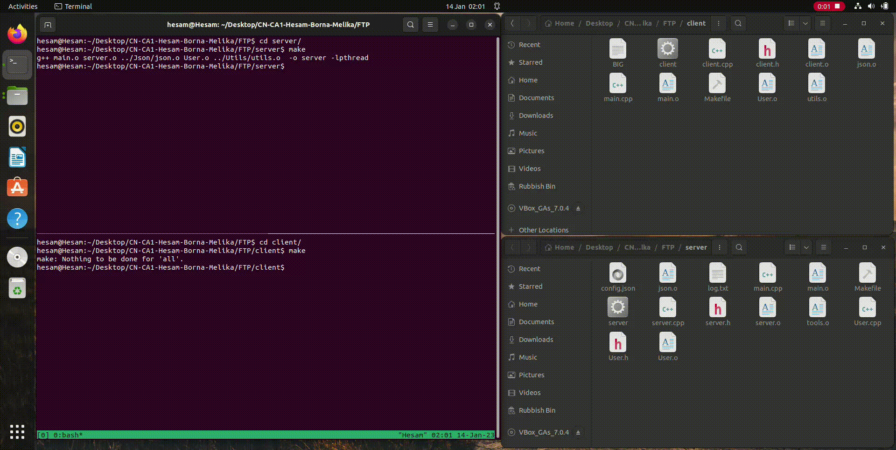

# FTP Server

## To Run:
Simply use makefiles present in client and server folders to make both server and client object files. Then bring up the server on your desired port with command:
```console
./{SERVER PATH}/server {Port (i.e. 8080)}
```

and then connect a client, with the following command:
```console
./{CLIENT PATH}/client {Port (i.e. 8080)}
```

Each client has the following commands:

* `user` which is used to enter username, in order to login.

    ```console
    user {Username}
    ```

* `pass` which is used to enter password of previously entered username, in order to complete the login procedure.

    ```console
    pass {Password}
    ```

* `quit` which is used to logout.

    ```console
    quit
    ```

* `retr` which is used to download a file. It downloads the specified file to a directory named `{Username}'s Files` for each user.
    ```console
    retr {File Path}
    ```

* `Upload` which is used to Upload a file (just for admin users). It uploads a file to the `Files` directory in the server's dir.
    ```console
    Upload {File Path}
    ```


## Root directory and project structure

The root directory consists of the *client*, *Json*, *server*, and *Utils* folders. The *Json* folder contains files that help us read and parse the *config.json* file available in the server folder. *config.json* stores the information about the command and data channel ports and some users' data such as usernames and passwords. It also tells us, which users are admins, and also the download limit (volume) for each user. 

The following describes the other three folders in more details.

## Utils Folder
* This module contains some helper functions which can be executed independently. 
* `socketData` struct is defined in this module as a combination of command channel socket and data channel socket:
```cpp
struct socketData
{
    int commandSocket;
    int dataSocket;
};
```
* `file_exists` gets a filename string and checks if it exists.
* `get_curr_path` return a string containing current path of the executed program.
* `extract_file_name` gets a file path and extracts just the name and extension of the file (removing it's parent path). (i.e. input: `/path/to/my/file/f1.cpp` &rarr; output: `f1.cpp`)

## Server Folder

### main:
```cpp
ports[0] = (char*)(json.getCommandPort().c_str());
ports[1] = (char*)(json.getDataPort().c_str());
server.connect_channel(ports);
std::cout << "Server is running..." << std::endl;
while(1) {
    socketData sock = server.handle_connections();
    int fork_c = fork();
    if(fork_c == 0) {
    server.handle_info(static_cast<void*> (&sock));
    break;
    }
}
wait(NULL);
```
* First, we extract command channel port and data channel port from the `config.json` file.
* Then, we connect channels using these ports. 
* After all, for each connection, a fork of the server is created and it handles the incoming information and requests.

### user:

```cpp
class User {
    public:
        User(std::string username_, std::string password_, bool admin_, int size_) : 
            username(username_), password(password_), admin(admin_), size(size_) {}
        std::string get_username();
        std::string get_password();
        bool is_admin();
        int get_size();
        void decrease_size(int size_);
    private:
        std::string username;
        std::string password;
        bool admin;
        int size;
};
```
* Each user has a username, password, a boolean variable defining administratorship of the user and remaining size of it.

### server:
```cpp
class  Server {
  public:
    Server() {
      json = Json();
      parse_json();
    }
    void parse_json();
    socketData handle_connections();
    void connect_channel(char* argv[]);
    bool find_username(std::string);
    bool find_pass(std::string , std::string, bool*);
    void handle_user(std::string*, bool*, bool, int, int, std::vector<std::string>);
    void handle_password(std::string, bool*, bool*, int, int, std::vector<std::string>, bool*);
    void handle_help(std::vector<std::string>, int, int, bool, bool, std::string);
    void handle_dl(std::vector<std::string>, int, int, bool, bool, bool, std::string, std::string);
    void handle_upload(std::vector<std::string>, int, int, bool, bool, bool, std::string, std::string);
    void handle_quit(std::vector<std::string>, int, int, bool*, bool*, std::string*, bool*, std::string*);
    void handle_info(void*);
    void send_help(int);
    void handle_error(int, int);
    void print_time();

  private:
    Json json;
    std::ofstream logs;
    int clientSockets[CLIENT_COUNT] = {0};
    int dataSockets[CLIENT_COUNT] = {0};
    struct sockaddr_in request_serverAddr;
    struct sockaddr_in data_serverAddr;
    int request_channel;
    int data_channel;
    std::vector<User> users_list;
    std::vector<std::string> protected_files;
    std::vector<std::string> login_commands{"Upload", "retr", "help", "quit"};
    std::vector<std::string> help;

    void print_login_error(std::string, int, int);
    void print_syntax_error(std::string, int, int, std::string);
};
```
* Our server stores a Json object which handles parsing and retrieving information from the `config.json` file.
* A `logs` variable is also stored in the server which is the log file we create and complete.
* Vectors of users, protected files, and commands that are permitted only when user is logged in, are stored in the server object.
* A number of helper functions are utilized to handle `user`, `password`, `help`, `retr`, `Upload`, and `quit` commands.

We now describe some of the more important functions in *server.cpp*.
* `handle_connections` is the function that's being called in *main.cpp* and handles both the request and data connections. If it cannot connect, it exits with an *EXIT_FAILURE* code, otherwise, it returns a new *socketData* variable we'll later use to handle user inputs.

* `connect_channel` sets the required settings to bind two sockets to both data and request channels and listens on the respective ports.

* `find_username` checks if there's a particular username present.
* `find_pass` checks if there input username and password match.
* `handle_user` handles the case where user wants to login.
* `handle_info` is a high-level function which handles the input from the command line. It calls the respective function for each of the available commands a user can type.
* `handle_password` if the input user and password are available (with the help from `find_pass`), this function logs the user into our program.
* `handle_help` handles the help command and calls `send_help` function.
* `handle_dl` checks if the input file exists and if the user has enough download credit. If so, it retrieves the file and stores it in a folder with the user's name. 
* `handle_upload` checks if the user is an admin. If so, it uploads the file to the *Files* folder available in the *server* folder.
* `handle_quit` logs out the username and deletes any useless variable.


## Client Folder

### client:
```cpp
class Client {
  public:
    void connect_channel(char* ports[]);
    void handle_info();
    void handle_help();
    void handle_dl(char* file_name);
    void handle_upload(char* file_name);
};
```
* Obviously, this class contains a number of handler functions to handle 4 primary commands.
* These handler functions are paired with their couple in the server which were explained above. Each `receive` in client is mapped to a `send` in server and vice versa.

### main:
```cpp
ports[0] = new char[256];
ports[1] = new char[256];
strcpy(ports[0], (char*)(json.getCommandPort().c_str()));
strcpy(ports[1], (char*)(json.getDataPort().c_str()));
c.connect_channel(ports);

FOREVER c.handle_info();
```

Connects the two channel ports and waits for the user to input the next command. It handles the commands by calling the `handle_info` function described above.

Note that if a client downloads a file, the file would be stored in a (new) folder with the client's name!

## Results:

